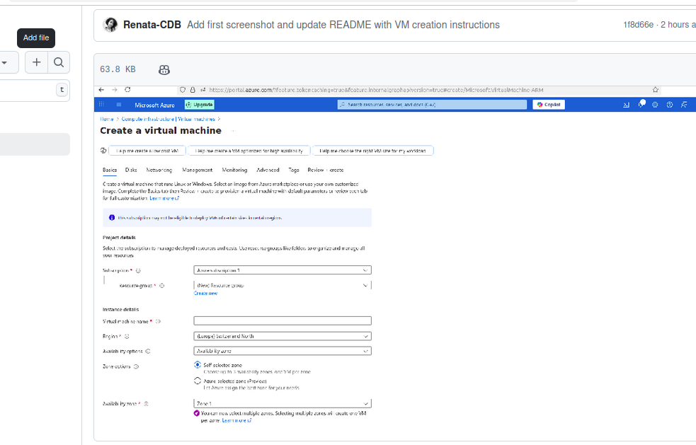

# 🚀 Azure Voting App Deployment

**Creating a Linux Virtual Machine to install Docker, download the application components, and test their functionality.**

This project is part of the **Cloud Bootcamp** and was developed during the **MultiCloud Experience** event, showcasing hands-on skills with Azure, Docker, and Virtual Machine setup.

---

## ✅ Technologies

- Microsoft Azure ☁️  
- Azure Virtual Machines (VM)  
- Docker 🐳 
- Linux (Ubuntu) 🐧 

---

## 📷 Screenshots

### 1. Create VM – Basic Settings



*Figure 1 – Virtual Machine creation screen on Azure*

---

## 📦 How to Reproduce

1. Create a Virtual Machine in Azure (Linux, Ubuntu)
2. Connect via SSH
3. Install Docker:
   ```bash
   sudo apt update
   sudo apt install docker.io -y
