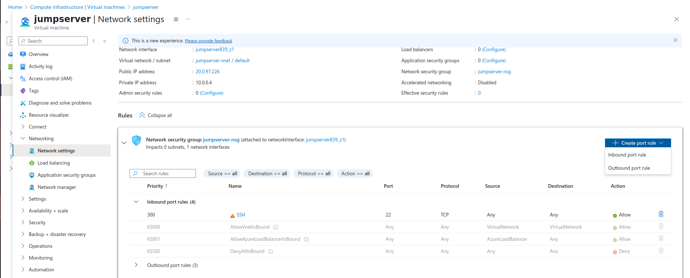
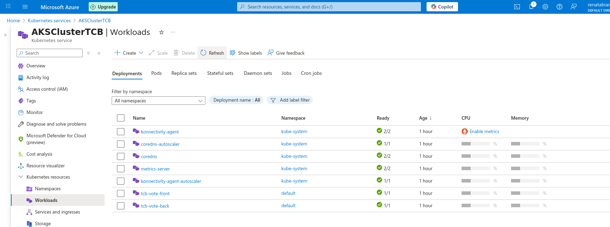

# Module 3 – Project Evidence

## Access to Azure Cloud Shell and validation of the VM operating system (Azure Linux 3.0).

## Validation of files in the VM home and permissions listed for the .pem key.

## Command `chmod 400` being applied to restrict access to the private key.

## Permissions successfully corrected for SSH access with private key.

## AKS cluster creation confirmation in Azure.

## Creation of Azure Container Registry (ACR).

## Infrastructure provisioning via terminal in Azure.

## NSG rule visualization allowing traffic on port 8080.

## Creation of new inbound rule to allow port 8080 (customized).

## Connection error resolved after key permission fix.

## Connection error when trying to access the app before the port was released.

