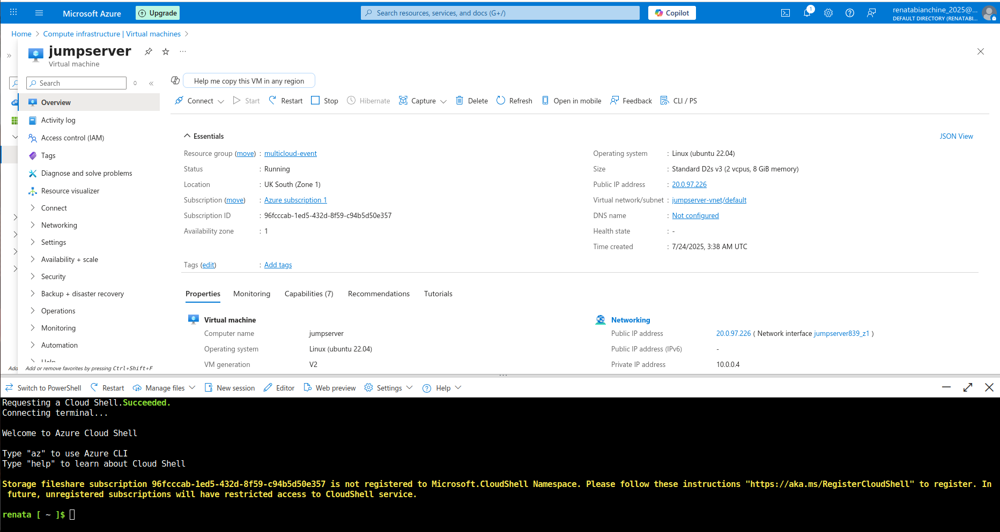
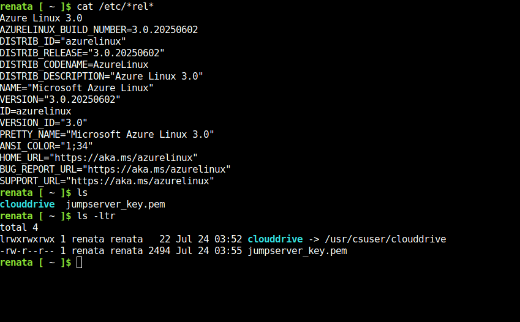
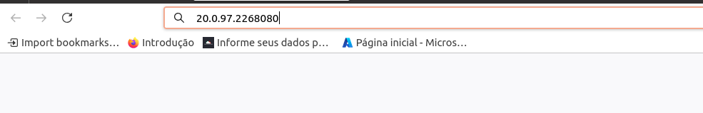

# Module 3 – Project Evidence

## 1. Create Virtual Machine on Azure

## 2. Validate key files and permissions in the VM

## 3. Apply chmod 400 to restrict private key access

## 4. SSH access permission successfully fixed

## 5. Create AKS Cluster

## 6. Create Azure Container Registry

## 7. Create infrastructure using the terminal

## 8. NSG rule allowing port 8080

## 9. Create custom inbound rule to open port 8080

## 10. Error due to private key permission

## 11. Error accessing app before port release

## 12. Successful app access after releasing the port

